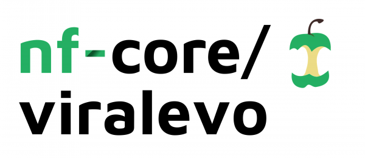

# 

[](https://www.nextflow.io/)
[](https://docs.conda.io/en/latest/)
[](https://www.docker.com/)
[](https://sylabs.io/docs/)

## Introduction

**nf-core-viralevo** is a bioinformatics pipeline used to perform low-frequency variant calling for viral samples. It supports illumina short-read sequencing data.

The pipeline is built using [Nextflow](https://www.nextflow.io), a workflow tool to run tasks across multiple compute infrastructures in a very portable manner. It uses Docker/Singularity containers making installation trivial and results highly reproducible. The [Nextflow DSL2](https://www.nextflow.io/docs/latest/dsl2.html) implementation of this pipeline uses one container per process which makes it much easier to maintain and update software dependencies. Where possible, these processes have been submitted to and installed from [nf-core/modules](https://github.com/nf-core/modules) in order to make them available to all nf-core pipelines, and to everyone within the Nextflow community!

## Pipeline summary

1. Read QC ([`FastQC`](https://www.bioinformatics.babraham.ac.uk/projects/fastqc/))
2. Adapter and Quality trimming ([`Cutadapt!`](https://cutadapt.readthedocs.io/en/stable/index.html))
3. Alignment ([`BWA!`](https://github.com/lh3/bwa))
4. Sort and index alignments ([`SAMtools`](https://sourceforge.net/projects/samtools/files/samtools/))
5.Alignment-level QC ([`SAMtools`](https://sourceforge.net/projects/samtools/files/samtools/))
5. Insert indel quality ([`LoFreq`](https://csb5.github.io/lofreq/commands)) 
6. Variant calling with LoFreq ([`LoFreq`](https://csb5.github.io/lofreq/))
7. Variant calling with iVAR ([`iVAR`](https://andersen-lab.github.io/ivar/html/manualpage.html))
8. Variant annotation ([`SnpEff`](http://pcingola.github.io/SnpEff/))
9. Present QC for raw reads ([`MultiQC`](http://multiqc.info/))

## Quick Start

1. Install [`Nextflow`](https://nf-co.re/usage/installation)

2. Install any of [`Docker`](https://docs.docker.com/engine/installation/), [`Singularity`](https://www.sylabs.io/guides/3.0/user-guide/), [`Podman`](https://podman.io/), [`Shifter`](https://nersc.gitlab.io/development/shifter/how-to-use/) or [`Charliecloud`](https://hpc.github.io/charliecloud/) for full pipeline reproducibility _(please only use [`Conda`](https://conda.io/miniconda.html) as a last resort; see [docs](https://nf-co.re/usage/configuration#basic-configuration-profiles))_

3. Download the pipeline and test it on a minimal dataset with a single command in the directory above the nf-core-viralevo directory::

    ```console
    nextflow run nf-core-viralevo -profile test,<docker/singularity/podman/shifter/charliecloud/conda/institute>
    ```

    * Please check [nf-core/configs](https://github.com/nf-core/configs#documentation) to see if a custom config file to run nf-core pipelines already exists for your Institute. If so, you can simply use `-profile <institute>` in your command. This will enable either `docker` or `singularity` and set the appropriate execution settings for your local compute environment.
    * If you are using `singularity` then the pipeline will auto-detect this and attempt to download the Singularity images directly as opposed to performing a conversion from Docker images. If you ar$

    ```bash
    NXF_SINGULARITY_CACHEDIR=/path/to/central/location nextflow run nf-core-viralevo -profile test,singularity
    ```

    * If you are using `conda`, it is highly recommended to use the [`NXF_CONDA_CACHEDIR` or `conda.cacheDir`](https://www.nextflow.io/docs/latest/conda.html) settings to store the environments in a c$

    ```bash
    NXF_CONDA_CACHEDIR=/path/to/central/location nextflow run nf-core-viralevo -profile test,conda
    ```

4. Start running your own analysis!
    
    *Typical command for singularity based variant calling (in the directory above the nf-core-viralevo directory):
    ```console
    NXF_SINGULARITY_CACHEDIR=/path/to/central/location nextflow run nf-core-viralevo \
        --input '[/path/to/samplesheet.csv]' \
        --primer_fasta '[/path/to/primer.fasta]' \
        --primer_bed '[/path/to/primer.bed]' \
        --genome '[viral_reference_genome_name]' \
        -profile singularity
    ```
    * Further details about the format of samplesheet.csv can be seen in the [usage](https://github.com/nibscbioinformatics/nf-core-viralevo/blob/master/docs/usage.md) document.
    * You will need to choose '[viral_reference_genome_name]' from /nf-core-viralevo/conf/igenomes.config file, e.g. 'SARS-CoV-2'. You can also add details of new viral reference genome of your own choice at the bottom of the file.

## Documentation

The nf-core-viralevo pipeline comes with documentation about the pipeline [usage](https://github.com/nibscbioinformatics/nf-core-viralevo/blob/master/docs/usage.md) and [output](https://github.com/nibscbioinformatics/nf-core-viralevo/blob/master/docs/output.md)

## Credits

nf-core-viralevo was originally written by Ravneet Bhuller and Martin Gordon.

Many thanks to others who have helped out along the way too, including (but not limited to):
[@MartinFritzsche](https://github.com/MartinFritzsche)

## Citations

You can cite the `nf-core` publication as follows:

> **The nf-core framework for community-curated bioinformatics pipelines.**
>
> Philip Ewels, Alexander Peltzer, Sven Fillinger, Harshil Patel, Johannes Alneberg, Andreas Wilm, Maxime Ulysse Garcia, Paolo Di Tommaso & Sven Nahnsen.
>
> _Nat Biotechnol._ 2020 Feb 13. doi: [10.1038/s41587-020-0439-x](https://dx.doi.org/10.1038/s41587-020-0439-x).
